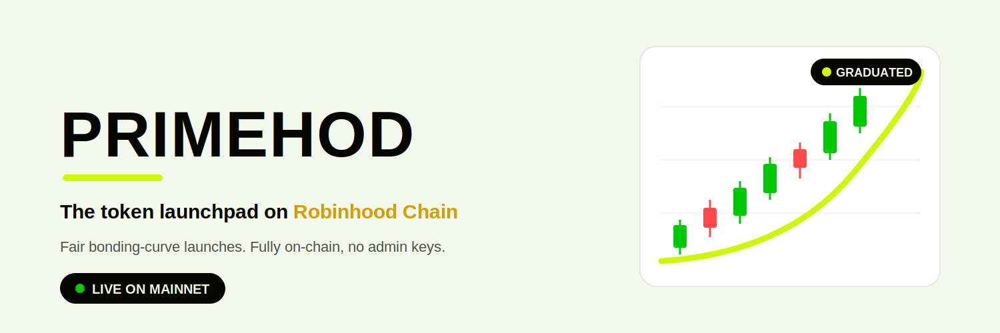

<p align="center">
  
</p>

# Primehod

Primehod is the token launchpad on **Robinhood Chain**, live on mainnet at **[primehod.lol](https://primehod.lol)**.

Launch a token in one transaction, trade it instantly on an on-chain bonding curve, and graduate when the community carries it to its cap. No presale, no allocation games, no admin keys over your liquidity.

**Website:** [primehod.lol](https://primehod.lol) · **X:** [@primehodl](https://x.com/primehodl)

## How it works

1. **Launch.** One transaction deploys your token, its vesting contract, and its market. Supply is fully minted at creation: no mint function, no pause, no blacklist, no owner.
2. **Trade.** 80% of supply goes straight onto an ETH constant-product bonding curve. Anyone can buy or sell from block one; the curve is always liquid.
3. **Graduate.** Each launch picks a graduation cap ($5k, $10k, or $20k). Reaching the cap marks the token as graduated; trading stays open on the curve rather than halting, so there is no forced lock-up.

## Why it is fair

- **Fully minted, admin-less tokens.** The ERC-20 has no owner and no privileged functions. What you buy is what exists.
- **Creator vesting, enforced on-chain.** 20% of supply vests to the creator at 1% per month over 20 months through an immutable vesting contract. No instant creator dumps.
- **Honest fees.** Each launch sets a base swap fee (1–5%) that ramps toward a 5% ceiling only during violent price moves, damping snipers. Fees split 55/45 between creator and platform, pulled on demand.
- **No hands on the liquidity.** After a pre-mainnet audit, the owner hook over graduated liquidity was removed entirely. The platform cannot touch curve reserves. Holders can always sell.
- **Everything on-chain.** The site renders straight from contract state and events: no database, no curated listings, no hidden numbers.

## Contracts

| Contract | Role |
| --- | --- |
| `PrimehodToken` | Fixed-supply ERC-20, fully minted at launch, zero admin |
| `PrimehodVesting` | Immutable monthly creator vesting (1% per month) |
| `PrimehodCurve` | ETH constant-product bonding curve with dynamic fee and 55/45 fee split |
| `PrimehodFactory` | One-transaction launch of token + vesting + curve |

Factory (Robinhood Chain mainnet, chainId 4663):

```
0x5ae4eF8726Bb721735eEc32e40E0c103679f1DA2
```

Verify it on the [Robinhood Chain explorer](https://robinhoodchain.blockscout.com/address/0x5ae4eF8726Bb721735eEc32e40E0c103679f1DA2).

## Robinhood Chain

Robinhood Chain is Robinhood's Arbitrum-based L2. Primehod runs on mainnet (chainId **4663**). The site ships its own same-origin RPC proxy, so it works even on networks where the chain RPC is blocked — no VPN, no manual RPC setup. Connect a wallet at [primehod.lol](https://primehod.lol) and the chain is added for you.

## Repository

```
contracts/   PrimehodToken · PrimehodVesting · PrimehodCurve · PrimehodFactory
scripts/     testPrimehodCurve.ts (behaviour) · auditAdversarial.ts (attack paths) · deployPrimehod.ts
SECURITY.md  full internal security review
```

## Security

The full [**security review is in `SECURITY.md`**](./SECURITY.md), with reproducible
tests for every claim. In short:

- **No custody over your funds.** The curve has no `withdraw`, `rescue`, `seedDex`, or
  `migrate` function. Nobody — not the platform, not the creator — can seize or move the
  pooled liquidity. Trading always happens on the curve; there is no admin off-ramp.
- **Solvency is enforced in code.** Payouts are capped at real ETH taken in; a
  maximum-size dump cannot drain more than exists. Proven by `scripts/auditAdversarial.ts`.
- **Admin-less tokens.** No mint, no pause, no blacklist, no owner on the ERC-20.
- **Immutable per-launch economics.** The owner can only change defaults for *future*
  launches; a live token can never be rewritten.
- **Fees capped at 5%**, so a launch can never be turned into a honeypot.

**What that does _not_ promise:** because the market is a single bonding curve with no
external DEX, exit liquidity is first-come. Sellers redeem against the real ETH in the
pool, so if others sell before you the pool can run dry and your sell can revert even
while the token still shows a price. And, as on any launchpad, each token's own creator
holds a vested allocation (20%, released 1%/month over 20 months) that can be sold on that
same curve once unlocked — normal sell pressure to factor in. See **M-1** and **M-2** in
[`SECURITY.md`](./SECURITY.md).

The one high-severity finding from pre-mainnet review — owner control over graduated
liquidity — was fixed by removing that capability entirely. This is an internal
engineering review, not a paid third-party firm audit; verify the contract on-chain
and read [`SECURITY.md`](./SECURITY.md) before committing significant funds.
